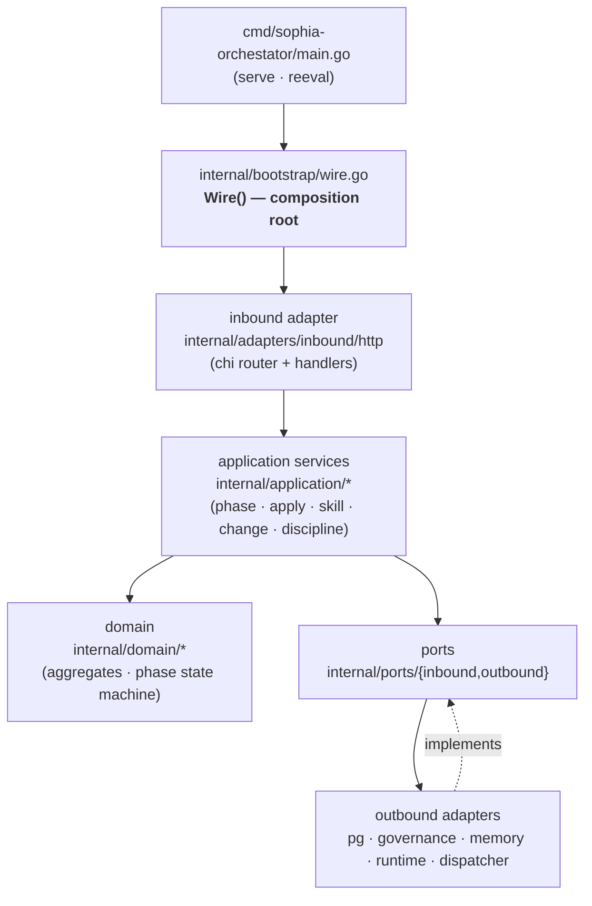
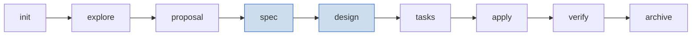
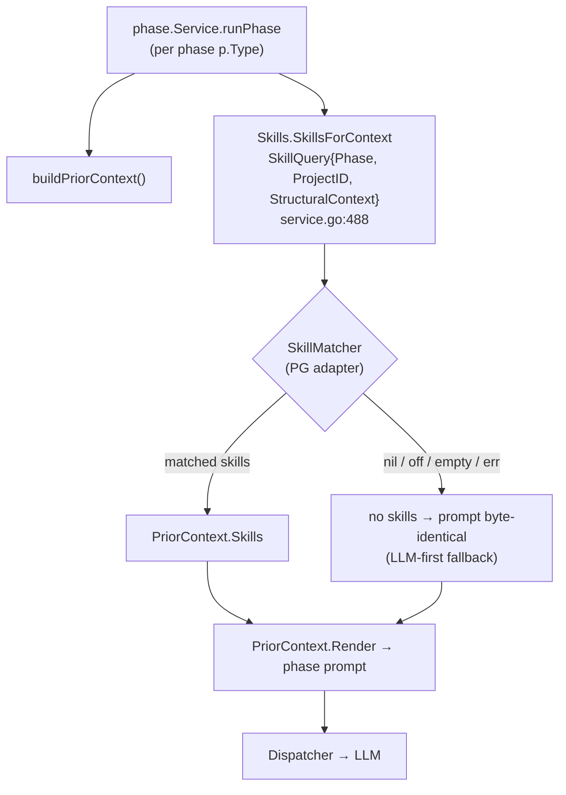
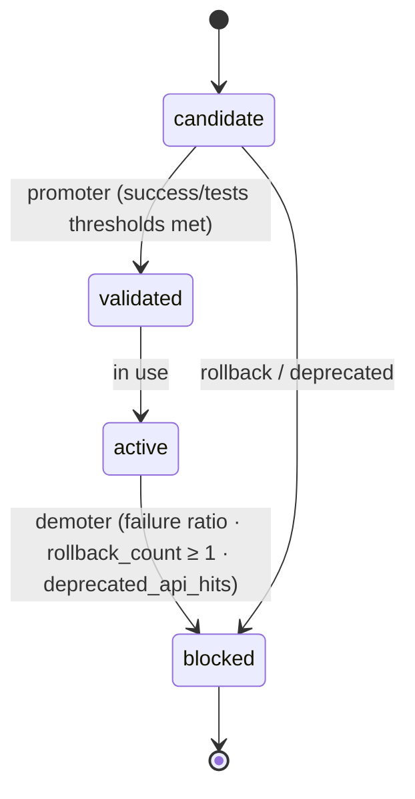
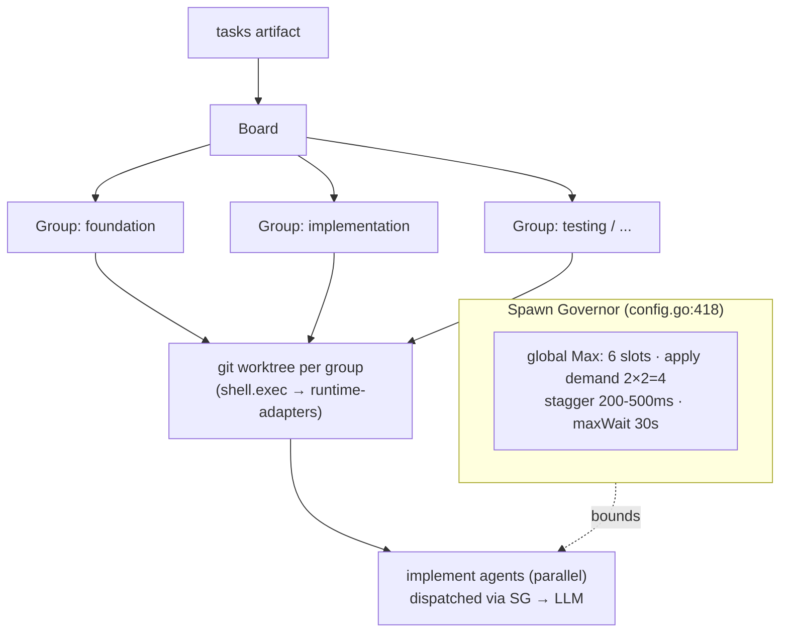
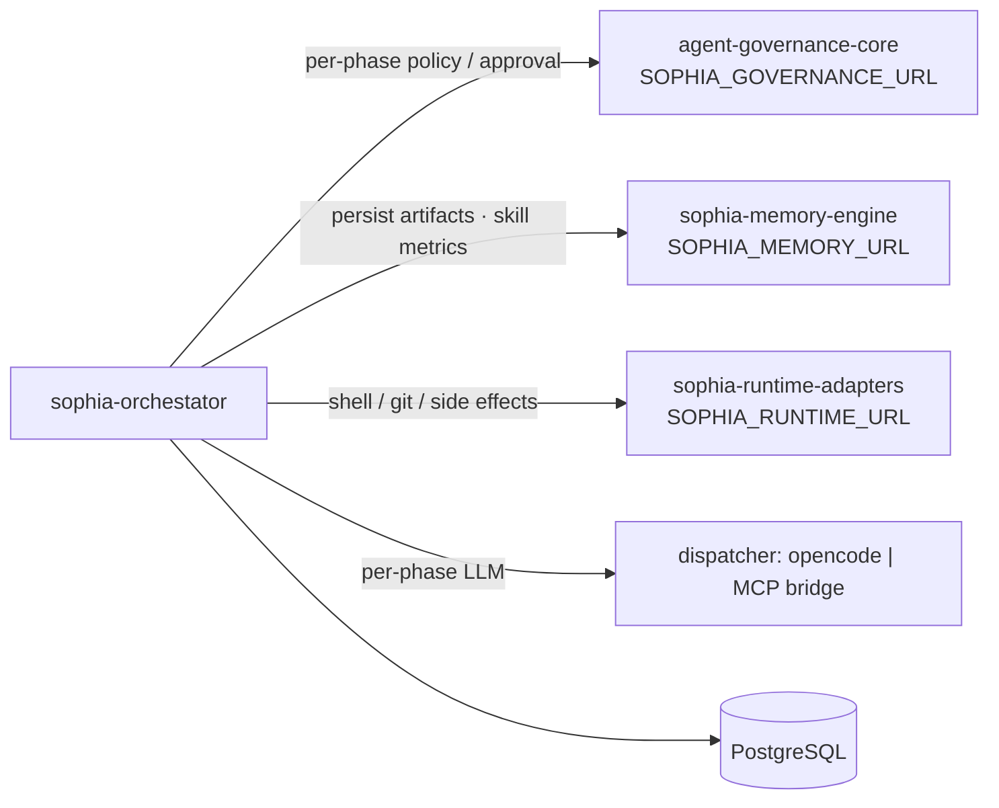

# Architecture — sophia-orchestator

> Grounded in the code (read directly + an AST knowledge graph of the 372 Go
> files), **not** in the openspec artifacts — those drift. Every non-obvious
> claim cites `file:line`. Diagrams are [Mermaid](https://mermaid.js.org) and
> render inline on GitHub.

## 1. What this service is

The **deterministic SDD workflow coordinator** of the Sophia ecosystem. It drives
a *Change* through the canonical SDD phases, emitting a **validated Envelope** at
every transition and persisting it **before** any caller-visible state change.

It does NOT decide policy (→ agent-governance-core), store knowledge
(→ sophia-memory-engine), execute side effects (→ sophia-runtime-adapters), or
run the LLM (that lives in the dispatcher: opencode subprocess or host MCP bridge).

## 2. Hexagonal layering

Dependencies point inward only; the AST graph shows **zero import cycles**.



Graph god-nodes (by edge degree): `Wire()` (DI bridge, highest betweenness),
`newRunService()` (apply engine), `NewPromptBuilder()` (prompt assembly),
`ParseChangeID()`/`ParsePhaseID()` (ULID parsing).

## 3. The SDD phase lifecycle

Phase types + their **strictly sequential** order live in
`internal/domain/phase/type.go` (`PhaseType` + `NextValid()`):



`NextValid()` is the single source of transition truth (`isNextValidTransition`
in `internal/application/phase/service.go` delegates to it). **`spec` and
`design` both run, sequentially** (design reads spec) — matching the reference
`cortex-ia` and the SDD field. Confidence gates (`type.go ConfidenceThreshold`):
explore 0.5 · proposal/design/apply 0.7 · spec/tasks 0.8 · verify/archive 0.9.

## 4. Phase execution flow

`POST /api/v1/changes/{id}/phases/{phase}/run` → `PhasesHandler.Run` → `phase.Service`:

```mermaid
sequenceDiagram
    actor C as Client / CLI
    participant H as PhasesHandler
    participant S as phase.Service
    participant G as Governance (port)
    participant D as Dispatcher (opencode/MCP)
    participant R as PhaseRepo (pg)

    C->>H: POST .../phases/{phase}/run
    H->>S: Run()
    S->>S: validate NextValid(currentPhase); ErrPhaseRunning if busy
    S->>R: Save Phase = pending  (before goroutine · L349)
    H-->>C: 200 {phase_id, events_url}  (SSE)
    Note over S: async goroutine
    S->>G: EvaluatePhase()  (L394) → allow / gate / deny
    S->>D: Dispatch()  (L578) → Envelope JSON
    S->>S: validate Envelope (schema + confidence)
    S->>R: Save Phase = done  ("Iron Law #1: persisted-before-return" · L711-716)
    S->>S: advanceChange() → currentPhase moves on
```

## 5. Skills — per-phase injection + lifecycle

Sophia is **LLM-first with an additive, optional skill layer**. Every phase
injects the skills that match it; if none match (or skills are disabled) the
prompt is byte-identical to the no-skills baseline — **fail-soft**
(`service.go:484-485`).



- Injection point moved from the generic prompt builder into `PriorContext`
  (`prompt_builder.go:90`, D-M3-5/PR3a). Apply additionally hydrates skills for
  its implement agents (`apply/teamlead.go hydrateSkills`). Toggle:
  `SOPHIA_SKILLS_ENABLED` (default on).
- Matcher port: `discipline.SkillMatcher.SkillsForContext`
  (`internal/application/discipline/skill_matcher.go`); PG adapter
  `internal/adapters/outbound/pg/skill_matcher.go`; wired in `wire.go`.
- A `Skill` (`internal/domain/skill`) is a **persisted entity** declaring the
  `phases []PhaseType` it applies to (≥1) + `AppliesWhen` (JSONB conditions).

**The differentiator** — vs the static `SKILL.md` files of cortex-ia / gentle-ai,
Sophia's skills are *governed entities with a lifecycle*:



The promoter/demoter (`internal/application/skill` + sophia-memory-engine
consolidation) score skills on **usage metrics** — `SuccessCount`, `FailureCount`,
`TestsPassedCount`, `AvgRetryReduction`, `RollbackCount`, `DeprecatedAPIHits`
(`internal/domain/skill/lifecycle.go:142-147`) — and walk the lifecycle via the
allowed transition map (`service.go:26-30`). A skill whose change was reverted
(`reeval --revert`) is demoted/blocked. The learning loop runs against
memory-engine (PATCH /skills metrics).

### Why it works (the value proposition)

This is the heuristic core: **`AvgRetryReduction`** — derived from
`SUM(tasks.attempts)` across the changes a skill was used in
(`internal/application/skill/reeval_provider.go`) — measures whether a skill
actually makes the LLM need *fewer retries* to produce a valid envelope. Skills
that demonstrably reduce retries get promoted; skills that correlate with
failures/rollbacks get demoted. So the system **learns which guidance works** and
keeps only that. Net effect: injecting curated, research-backed prompting
techniques per phase makes the *same* (even weaker) model materially more
reliable — Sophia turns a "dumber" LLM into a more capable one, and gets better
over time. **LLM-first → skills-when-they-match → skills-that-learn.**

> Retrieval today is **lexical FTS** (pg_trgm + tsvector) in sophia-memory-engine;
> vector/semantic embeddings are a noop stub + empty scaffold (Phase 2, not yet
> implemented) — documented here to avoid implying a capability the code lacks.

## 6. The apply phase

The most complex phase, centered on `newRunService()`
(`internal/application/apply`). Inspired by cortex-ia's apply-board pattern:



Caps are real values in `internal/infrastructure/config/config.go` (`SpawnConfig`,
~L418): `Max: 6`, stagger 200-500 ms, wait 250 ms, max wait 30 s. Override via
`SOPHIA_SPAWN_MAX`.

## 7. The dispatcher (pluggable LLM)

Selected in `internal/bootstrap/wire.go` by `cfg.Dispatcher.Provider`:
`opencode` (in-container subprocess, default) or `mcp` (host-side bridge
`sophia-agent-mcp` over Streamable HTTP at `host.docker.internal:7775`). Other
adapters (ollama, aider) under `internal/adapters/outbound/dispatcher/`.

## 8. Outbound ports (cross-service)



## 9. Persistence

PostgreSQL via `pgx/v5` (`internal/adapters/outbound/pg`). Migrations under
`migrations/postgres/` (golang-migrate), auto-applied on boot when
`SOPHIA_DB_MIGRATE_ON_BOOT=true`. Tables: changes, phases (`envelope`,
`concerns`), apply board (groups/tasks/sessions/worktrees), audit, spawn governor
state, skills + skill_usage, outbox, reeval_runs, phase_concerns.

## 10. Key invariants

- **D1.2 / Iron Law #1** — persist the Envelope BEFORE any caller-visible state
  change (`service.go:711`).
- **5 Iron Laws** — enforced at phase boundaries (`internal/application/discipline`).
- **Determinism** — no direct `time.Now()` / `ulid.Make()` in domain/application;
  injectable `Clock` + `IDGenerator`.
- **Boundary discipline** — never decide policy, store memory, or execute side
  effects directly; always via an outbound port.

## 11. Where to start reading

1. **This file (`ARCHITECTURE.md`) — code-grounded source of truth.**
2. `cmd/sophia-orchestator/main.go` — entrypoint.
3. `internal/bootstrap/wire.go` — `Wire()` composition.
4. `internal/domain/phase/type.go` — phase state machine.
5. `internal/application/phase/service.go` — phase execution + skill injection.
6. `internal/application/apply` — apply board + spawn governor.

> A queryable AST knowledge graph lives in `graphify-out/` —
> `graphify query "<question>"` to navigate the code.
