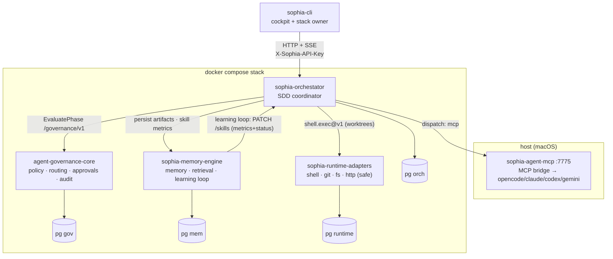

# Sophia Ecosystem — Architecture & Capabilities

> Code-grounded map of all six services (capabilities extracted by reading each
> repo's code, **not** the openspec/docs which drift). Each repo also has its own
> queryable AST graph under `graphify-out/` (`graphify query "<question>"`).
> Diagrams are [Mermaid](https://mermaid.js.org) and render on GitHub.

## The six services

| Service | Role (one line) | Port |
|---|---|---|
| **sophia-orchestator** | Deterministic SDD workflow coordinator (drives the 9 phases) | 8080 |
| **agent-governance-core** | Decides: policy, routing, approvals, audit | 8080 (8082 local) |
| **sophia-memory-engine** | Remembers + learns: typed memory, retrieval, skill consolidation | 8080 (8081 local) |
| **sophia-runtime-adapters** | Executes: shell/git/fs/http side effects, safely | 8080 (8083 local) |
| **sophia-agent-mcp** | Bridges the LLM: host-side MCP → opencode/claude/codex/gemini | 7775 (host only) |
| **sophia-cli** | Cockpit: drives the orchestrator, owns the local stack | — (CLI) |

**Boundary principle (the core discipline):** orchestrator *coordinates* but does
not decide / remember / execute / run the LLM. Each of those is a separate
service behind an outbound port.

## The mounted architecture



## Capabilities per service ("bondades", code-grounded)

### sophia-orchestator — coordinate
- 9-phase SDD state machine, **strictly sequential** `init→explore→proposal→spec→design→tasks→apply→verify→archive` (`domain/phase/type.go NextValid`; spec+design both run).
- Persist-before-state-change (Iron Law #1, `phase/service.go:711`); envelope validation + per-phase confidence gates.
- **Per-phase skill injection** (fail-soft) + **skill lifecycle** (candidate→validated→active, promoter/demoter) — the heuristic that makes weaker LLMs reliable (`AvgRetryReduction`).
- **Apply board**: groups → git worktrees → parallel implement agents, bounded by the **Spawn Governor** (Max 6).
- Pluggable dispatcher (opencode subprocess | MCP host bridge). 9 canonical phase-skill templates seeded at boot. INIT structural cache (reuse analysis). Full details: [`ARCHITECTURE.md`](ARCHITECTURE.md).

### agent-governance-core — decide
- **Policy evaluation**: 6 ordered rules, most-restrictive-wins, HARD-GATE deny (`data_deletion`), Iron Law #2 (no apply without tasks done). No-bypass: routing decision required first.
- **Score-based routing**: 6 weighted factors → `direct | decompose | escalate`; `decompose` spawns child subtasks.
- **Adaptive routing** (flag-gated `ADAPTIVE_ROUTING_ENABLED`): replays the audit trail to adjust scores by observed failure rates.
- **Workflow state machine** (created→routed→policy_checked→running/awaiting_approval→terminal), **approval gates**, **kill switch** (any state), **escalation**, **execution leases** (timeout/retry budgets → quarantine).
- **Circuit breaker** per (tool, agent_role) — in-memory, 3-fail or >50%/20-sample trip, self-auditing.
- **Append-only audit trail** (every decision). `/governance/v1` facade for orch + `govhttptest` cross-module test seam.

### sophia-memory-engine — remember + learn
- **Typed memory**: episodic (time-anchored) · semantic (topic-key upsert) · heuristics (condition-action, versioned) · decision ledger (lifecycle + supersedes chain) · typed relations (8 edge types).
- **Hybrid retrieval**: Postgres FTS (`tsvector`) + trigram (`pg_trgm`), **7-signal composite ranking** with explainable breakdown; token-budgeted **context builder** with depth-1 graph expansion.
- **Graph traversal**: recursive SQL CTE (no graph DB), direction-aware, depth/fanout caps.
- **Consolidation / learning loop**: webhook on phase.archived → compute skill metric deltas → PATCH orch → **promoter/demoter/proposer** (risk-aware thresholds) → digest. Temporal validity + freshness. 2-phase atomic security purge.

### sophia-runtime-adapters — execute (safely)
- Adapters: `shell.exec@v1` (no shell interpolation, allowlisted commands/dirs, isolated env) · `git.*@v1` (go-git, **no hooks**, ssh-agent only) · `filesystem.*@v1` (symlink-escape blocked, **atomic temp+fsync+rename**, sha256) · `http.request@v1` (**SSRF block** RFC1918/loopback at resolve-time, TLS mandatory, redirect/size caps).
- **Safety = allowlist-at-construction** (adapter won't boot with empty allowlists). Immutable **ExecutionReceipt** persisted-before-return + **idempotency** store. Result normalization (5 statuses; raw never crosses domain).
- Chaos injection (15 fault kinds, off by default). OTel (11 instruments). Sidecars: linear-webhook, grafana-annotations. Image targets: distroless (default) + debian llm-opencode/ollama/aider.

### sophia-agent-mcp — bridge the LLM
- **MCP Streamable HTTP** server (loopback-only), tools `agent.run` / `agent.health`.
- **opencode supervisor** (attach-spawn: one long-lived `opencode serve`, port discovery, readiness probe, restart loop + crash cap) — avoids per-dispatch cold boot.
- **9-layer security** before any subprocess: loopback → bearer (constant-time) → Origin allowlist → provider allowlist → cwd exact → cwd prefix → env allowlist → payload cap → MCP tool allowlist.
- **MCP provider proxying**: graphify (8 tools) + context7 (2-tool pin) with lazy spawn + schema hydration. Token rotation (0600). Host-only, no DB, no Keychain (env-allowlist creds).

### sophia-cli — cockpit
- Commands: `run · start · stop · attach · status · changes · approve · reject · abort · doctor · init · version`.
- **Phase multiplexer**: stitches per-phase SSE streams across a Change with up to 12 re-subscribes/phase (survives slow LLM calls); backoff + watchdog + `Last-Event-ID`.
- Owns the compose stack (`start`/`stop` → `docker compose -p sophia`), smart materialize/upgrade. 5-layer config resolution, XDG state (atomic), Bubble Tea TUI (timeline + apply board + approval banner) or `--json`.
- Wire contract shared via `pkg/contract` (CI parity test with orch).

## End-to-end flow — one SDD phase

```mermaid
sequenceDiagram
    participant CLI as sophia-cli
    participant ORCH as orchestator
    participant GOV as governance
    participant MCP as agent-mcp (host)
    participant RT as runtime-adapters
    participant MEM as memory-engine

    CLI->>ORCH: run phase (HTTP) + subscribe SSE
    ORCH->>GOV: EvaluatePhase → allow/gate/deny
    ORCH->>MCP: dispatch (mcp) → opencode LLM → Envelope
    ORCH->>ORCH: validate + persist Envelope (Iron Law #1)
    ORCH->>MEM: persist artifact (spec/design/tasks/...)
    Note over ORCH,RT: apply phase only
    ORCH->>RT: shell.exec@v1 (git worktree, cp) ; implement agents via MCP
    Note over ORCH,MEM: on archive
    ORCH->>MEM: webhook phase.archived
    MEM->>ORCH: PATCH /skills metrics+status (promote/demote)
```

## Honest status — real vs stub (per code, not docs)

| Area | Status |
|---|---|
| orch: phases, skills, apply board, dispatcher | REAL |
| governance: policy/routing/workflow/approvals/breaker/audit | REAL |
| **governance → memory integration** | **STUB** (`StubMemoryContextProvider`) |
| **governance `/governance/v1` policy** | **default-allow stub** (real policy engine is the `/api/v1` surface) |
| memory: typed memory, FTS+trigram, ranking, consolidation loop | REAL |
| **memory: vector/semantic embeddings** | **STUB** (noop) — retrieval is lexical FTS; Phase 2 |
| runtime: shell/git/fs/http + safety + receipts/idempotency | REAL |
| agent-mcp: opencode dispatch + supervisor + proxy + security | REAL |
| **agent-mcp: claude/codex/gemini provider CLIs** | **placeholders** (opencode is the validated path) |
| cli: commands, SSE multiplexer, stack, TUI | REAL |
| **cli ↔ orch wire** | known M10 gaps (some aspirational events, `/healthz` naming) |
| circuit breaker state | in-memory (lost on restart, by design) |
| chaos injection | compiled in, OFF by default |
| auth between backend services | none in V1 (network-isolated) |

## Shared tech foundation

Go 1.26 · hexagonal architecture (domain → ports → application → adapters, **zero
import cycles** across all repos) · PostgreSQL via `pgx/v5` · `chi/v5` router ·
ULID IDs · OpenTelemetry (opt-in) · `slog` · distroless images · testcontainers
for integration tests · golangci-lint v2.

> Per-repo deep dives: each repo's `graphify-out/GRAPH_REPORT.md` + `graph.json`.
> orch's full internals: [`ARCHITECTURE.md`](ARCHITECTURE.md).
